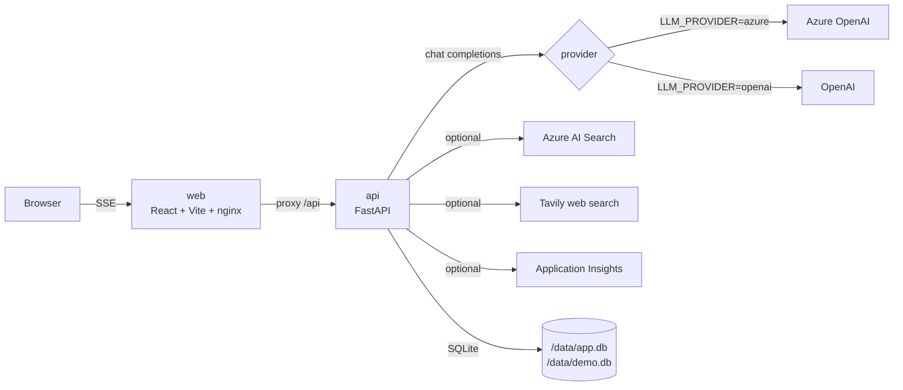

# Azure AI Agent Quickstart

A lean, Dockerized demo that shows what an AI agent looks like end to end. Clone, drop one provider's API key into `.env`, run one bash command, and you are chatting with two agents whose tool calls, token usage, dollar cost, raw SSE events, and evaluation scores are all visible in the UI.

```
clone  →  edit .env  →  ./run.sh  →  localhost:5173
```

Originally built for Microsoft employees experimenting with Azure OpenAI, but the abstraction is provider-agnostic — point it at Azure OpenAI or OpenAI directly without changing any code, just by setting `LLM_PROVIDER` in `.env`. Anthropic support is stubbed out and arrives in a future commit.

## What you get

- **Two agents** sharing one ~150-line tool-calling loop (`api/app/agent.py`) — read it in one sitting.
  - **Research Assistant** — `search_docs` tool. Uses Azure AI Search if you configured it, otherwise a local SQLite FTS5 index seeded from `api/sample_docs/`. Optional `web_search` tool via Tavily (toggle in the header).
  - **Ops Helper** — `run_sql` against a seeded demo SQLite (employees / tickets / revenue), plus `calculator`.
- **Multi-provider abstraction.** Pick `LLM_PROVIDER=azure` or `LLM_PROVIDER=openai` in `.env`. Each provider sits behind a small `providers/` package built around four internal events (`TextDelta`, `ToolCallStart`, `ToolArgsDelta`, `Usage`); the agent loop has zero vendor knowledge.
- **Streaming chat UI** with inline collapsible tool-call cards (name, args, result, latency).
- **Inspector panel** (right): per-session token & USD budget with progress bars, per-turn and cumulative usage, ordered tool-call timeline, and one-click LLM-as-judge evaluation (Groundedness / Relevance / Coherence).
- **Developer drawer** (`{ }` button in the header): two tabs.
  - *Client events* — every SSE event this browser tab received for the current session, color-coded, pretty-printed JSON.
  - *Server events* — paired `llm.request` / `llm.response` rows captured server-side, with provider, model, latency, and token counts. Auto-refreshes after each turn.
- **Web search toggle** in the header — when `TAVILY_API_KEY` is set, the Research Assistant gets a `web_search` tool you can flip on per-session for current-events questions.
- **Graceful degradation** — every optional integration (Azure AI Search, Application Insights, Tavily, Anthropic) disables cleanly when not configured. The app never crashes on a missing key.

## Prerequisites

- Docker Desktop (or any `docker compose`-capable runtime).
- **One** LLM provider account:
  - **Azure OpenAI** with a `gpt-4o-mini` deployment (see [docs/GET_AZURE_KEYS.md](docs/GET_AZURE_KEYS.md) for a 10-step portal walkthrough), **or**
  - **OpenAI** account with an API key — sign up at [platform.openai.com](https://platform.openai.com).

That's it. No Bicep, no Terraform, no Cosmos, no Azure Container Apps, no Foundry Agent Service.

Optional, all auto-detected from `.env`:

- **Azure AI Search** — replaces the local FTS5 index for the Research Assistant.
- **Tavily** — enables the web search toggle. Free tier: 1,000 searches/month at [tavily.com](https://tavily.com).
- **Application Insights** — sends OpenTelemetry traces to App Insights in addition to the in-process ring buffer.

## Architecture



Two containers: `api` and `web`. Everything else is a file.

## Quickstart (5 steps)

1. Clone the repo.
   ```bash
   git clone https://github.com/jgdallas/azure-ai-agent-quickstart.git
   cd azure-ai-agent-quickstart
   ```
2. Run once. The first run copies `.env.example` to `.env` and exits.
   ```bash
   ./run.sh
   ```
3. Edit `.env`. At minimum, set `LLM_PROVIDER` and fill in that provider's block:
   - `LLM_PROVIDER=azure` → set `AZURE_OPENAI_ENDPOINT`, `AZURE_OPENAI_API_KEY`, `AZURE_OPENAI_DEPLOYMENT`. See [docs/GET_AZURE_KEYS.md](docs/GET_AZURE_KEYS.md).
   - `LLM_PROVIDER=openai` → set `OPENAI_API_KEY`, `OPENAI_MODEL` (defaults to `gpt-4o-mini`).

   Optionally fill in `TAVILY_API_KEY` to enable the web-search toggle. Leave the other blocks blank.
4. Run again. This builds the images, starts compose, and waits for health.
   ```bash
   ./run.sh
   ```
5. Open [http://localhost:5173](http://localhost:5173).

API docs: [http://localhost:8000/docs](http://localhost:8000/docs).

`run.sh` only validates the block matching your `LLM_PROVIDER` choice and reports which other providers and optional integrations are configured.

## What to try first

- **Research Assistant:** *"What does the repo say about function calling and streaming? Cite the document titles."* — exercises `search_docs` against the seeded sample corpus.
- **Ops Helper:** *"Which P1 tickets are open right now, and who is assigned?"* — exercises `run_sql` against the demo database.
- **Web search (toggle on):** *"What major announcements has OpenAI made about their developer API in the last 30 days? Cite URLs."* — Research Assistant calls `web_search`, you see the Tavily results expand inline.

After any reply, click **Evaluate last response** in the Inspector to see the LLM-as-judge scores, and click the `{ }` button to inspect the raw SSE feed and the server-side LLM calls that produced the answer.

## Repo layout

```
azure-ai-agent-quickstart/
├── run.sh                    validates .env, starts compose, prints URLs
├── docker-compose.yml        api + web only
├── .env.example              required + optional vars, well commented
├── api/                      FastAPI backend (Python 3.12)
│   ├── app/
│   │   ├── agent.py          the tool-calling loop — read this first
│   │   ├── agents_registry.py  two agents, each a system prompt + tool bundle
│   │   ├── providers/        provider abstraction
│   │   │   ├── base.py       internal event types + Provider Protocol
│   │   │   ├── _openai_compat.py  shared streaming impl (Azure + OpenAI)
│   │   │   ├── azure.py      AzureOpenAI client factory
│   │   │   ├── openai.py     OpenAI client factory
│   │   │   └── _instrumented.py  records llm.request / llm.response
│   │   ├── tools/
│   │   │   ├── search.py     Azure AI Search if configured, else FTS5
│   │   │   ├── sql.py        read-only SELECT against demo.db
│   │   │   ├── calc.py       AST-based safe arithmetic
│   │   │   └── web.py        Tavily web search (optional)
│   │   ├── budget.py         per-session tokens + USD, nested price table
│   │   ├── evaluation.py     LLM-as-judge with inline schema
│   │   ├── persistence.py    SQLite: sessions, runs, messages, events, FTS5
│   │   ├── telemetry.py      in-memory ring + optional App Insights
│   │   └── routers/          chat (SSE), runs, budget, evaluations, traces, providers
│   ├── sample_docs/          ~20 short markdown files for the local RAG fallback
│   └── tests/                pytest covering agent loop + providers + Tavily
├── web/                      React + Vite + Tailwind + nginx
│   └── src/components/       AgentPicker, ChatPanel, Inspector, DevDrawer, WebSearchToggle
└── docs/
    └── GET_AZURE_KEYS.md     10-step portal walkthrough (Azure OpenAI path)
```

## Troubleshooting

| Symptom | Fix |
|---|---|
| `./run.sh` says "Created .env" and exits | First-run behavior. Fill in `.env` and run it again. |
| Validation fails with `x AZURE_OPENAI_*` (or `x OPENAI_*`) | Those vars are empty or placeholders. Open `.env`, set them, re-run. Only the block matching your `LLM_PROVIDER` is required. |
| UI shows "No LLM provider is configured" | Health endpoint reports zero configured providers. Either `LLM_PROVIDER` is unset or the matching block is blank. |
| `api did not become healthy` | `docker compose logs api`. Common cause: bad endpoint URL, wrong deployment name (Azure), or expired key. |
| Chat returns `[error] LLM call failed: ...` | Check the error text. 401 = bad key. 404 = deployment name doesn't exist. 429 = over rate limit. |
| Port 8000 in use | Another container is holding it (Airbyte's `airbyte-abctl-control-plane` is a common culprit on Mac). `docker stop <that-container>` or change the api port mapping in `docker-compose.yml`. |
| Web search returns 403 with HTML body | If you're on a Mac running Cloudflare WARP, disable it — Tavily fronts on Cloudflare and WARP routes Cloudflare traffic in a way that hits a WAF rule. Test from a non-WARP network. |
| Research answers are shallow | Without Azure AI Search, the agent searches 20 seeded markdown files. Either fill in `AZURE_AI_SEARCH_*` or turn on the web search toggle (`TAVILY_API_KEY`). |
| Web search toggle is disabled with a tooltip | `TAVILY_API_KEY` is unset on the server. Add it to `.env` and `docker compose up -d --force-recreate api`. |

## Upgrade paths

When this demo is no longer enough:

- **Auth.** Swap `*_API_KEY` for `DefaultAzureCredential` from `azure-identity`; grant the container's managed identity the Cognitive Services OpenAI User role.
- **Anthropic.** A clean adapter slot exists at `api/app/providers/anthropic.py`; the dispatcher errors with a "not yet implemented" message until that file is filled in.
- **Agent runtime.** Replace the loop in `api/app/agent.py` with the Azure AI Foundry Agent Service. The two routers (`chat.py` and `agents_registry.py`) are the only seams you need to touch.
- **Evaluation.** Swap `evaluation.py` for the `azure-ai-evaluation` SDK and run dataset-level evaluations from Foundry.
- **Telemetry.** Already wired — set `APPLICATIONINSIGHTS_CONNECTION_STRING` and OpenTelemetry traces flow to App Insights automatically.

## License

MIT.
