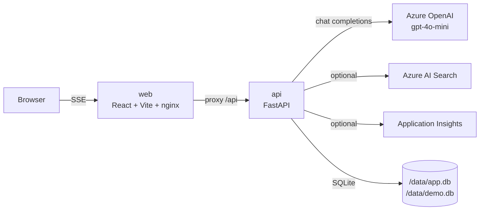

# Azure AI Agent Quickstart

A lean, Dockerized demo that shows what an Azure-hosted AI agent looks like end to end. Clone, drop an Azure OpenAI endpoint and key into `.env`, run one bash command, and you are chatting with two agents whose tool calls, token usage, dollar cost, and evaluation scores are all visible in the UI.

```
clone  →  edit .env  →  ./run.sh  →  localhost:5173
```

## What you get

- Two agents sharing one ~150-line tool-calling loop (`api/app/agent.py`) — read it in one sitting.
  - **Research Assistant** — `search_docs` tool. Uses Azure AI Search if you configured it, otherwise a local SQLite FTS5 index seeded from `api/sample_docs/`.
  - **Ops Helper** — `run_sql` against a seeded demo SQLite (employees/tickets/revenue) plus `calculator`.
- Streaming chat UI with inline tool-call cards.
- Inspector panel: session token budget, dollar budget, per-turn usage, tool-call timeline, and one-click LLM-as-judge evaluation (Groundedness / Relevance / Coherence).
- Graceful degradation: if an optional integration is not configured, the feature disables cleanly — the app never crashes on missing keys.

## Prerequisites

- Docker Desktop (or an equivalent `docker compose`-capable runtime).
- One Azure OpenAI resource with a deployment of `gpt-4o-mini`. See [docs/GET_AZURE_KEYS.md](docs/GET_AZURE_KEYS.md) for a 10-step portal walkthrough.

Nothing else. No Bicep, no Terraform, no Cosmos, no Azure Container Apps.

## Architecture



Two containers: `api` and `web`. Everything else is a file.

## Quickstart (5 steps)

1. Clone the repo.
   ```bash
   git clone https://github.com/jgdallas/azure-ai-agent-quickstart.git
   cd azure-ai-agent-quickstart
   ```
2. Run once. The first run copies `.env.example` to `.env` and exits.
   ```bash
   ./run.sh
   ```
3. Edit `.env`. Fill in the four `# REQUIRED` values (endpoint, key, deployment name, API version). See [docs/GET_AZURE_KEYS.md](docs/GET_AZURE_KEYS.md).
4. Run again. This builds the images, starts compose, and waits for health.
   ```bash
   ./run.sh
   ```
5. Open [http://localhost:5173](http://localhost:5173).

API docs: [http://localhost:8000/docs](http://localhost:8000/docs).

## What to try first

Pick one of these to get a feel for the UI:

- **"What does the repo say about function calling and streaming? Cite the document titles."** — exercises the Research Assistant against the seeded sample docs.
- **"Which P1 tickets are open right now, and who is assigned?"** — exercises the Ops Helper's `run_sql` tool against the demo database.
- **"Total revenue across all products in Q1 2026, rounded to the nearest thousand."** — Ops Helper uses `run_sql` plus `calculator`, and you see both in the tool timeline.

After any reply, click **Evaluate last response** in the Inspector to see the judge scores.

## Repo layout

```
azure-ai-agent-quickstart/
├── run.sh                    validates .env, starts compose, prints URLs
├── docker-compose.yml        api + web only
├── .env.example              required + optional vars, well commented
├── api/                      FastAPI backend (Python 3.12)
│   ├── app/
│   │   ├── agent.py          the tool-calling loop — read this first
│   │   ├── agents_registry.py  two agents, each a system prompt + tool bundle
│   │   ├── tools/            search / sql / calculator
│   │   ├── budget.py         per-session tokens + USD
│   │   ├── evaluation.py     LLM-as-judge
│   │   ├── persistence.py    SQLite: sessions, runs, messages, events, FTS5
│   │   ├── telemetry.py      in-memory ring buffer + optional App Insights
│   │   └── routers/          chat (SSE), runs, budget, evaluations, traces
│   ├── sample_docs/          ~20 short markdown files for the local RAG fallback
│   └── tests/                agent loop tests with a mocked LLM
├── web/                      React + Vite + Tailwind + nginx
└── docs/
    └── GET_AZURE_KEYS.md     10-step portal walkthrough
```

## Troubleshooting

| Symptom | Fix |
|---|---|
| `./run.sh` says "Created .env" and exits | That's first-run behavior. Fill in `.env` and run it again. |
| Validation fails with `x AZURE_OPENAI_*` rows | Those variables are empty or placeholders in `.env`. Open `.env`, set them, re-run. |
| UI shows a yellow banner "Azure OpenAI is not configured" | Same as above — health endpoint says keys are missing. |
| `api did not become healthy` | Inspect logs: `docker compose logs api`. Most common cause is a bad endpoint URL (must be `https://...openai.azure.com`, no trailing path). |
| Chat returns `[error] LLM call failed: ...` | Check the error text. 401 = bad key. 404 = deployment name doesn't exist in that resource. 429 = you are over TPM. |
| Research answers are shallow | If Azure AI Search is not configured, the agent is searching 20 seeded markdown files. Point it at a real index by filling in the `AZURE_AI_SEARCH_*` vars. |

## Upgrade paths

Where to go next when this demo is not enough:

- **Auth**: swap `AZURE_OPENAI_API_KEY` for `DefaultAzureCredential` from `azure-identity`, grant the container identity the Cognitive Services OpenAI User role.
- **Agent runtime**: replace the custom loop in `api/app/agent.py` with the Azure AI Foundry Agent Service. The two routers (`chat.py` and `agents_registry.py`) are the only seams you need to touch.
- **Evaluation**: swap `evaluation.py` for the `azure-ai-evaluation` SDK and dataset-level evaluation runs in Foundry.
- **Telemetry**: the `APPLICATIONINSIGHTS_CONNECTION_STRING` path is already there — just set the env var.

## License

MIT.
